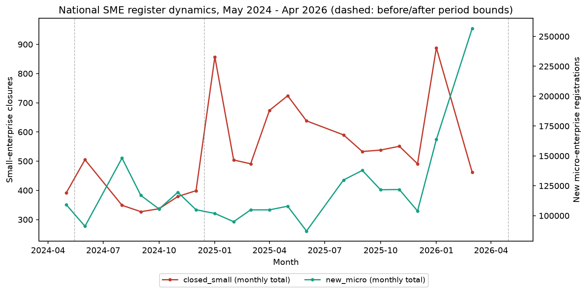

# Structural change in the Russian SME sector (2025–2026)

A reproducible, evidence-first analysis of the **176,647-row** federal SME register (May 2024 – Apr 2026): do small-enterprise closures, new micro-firm registrations and the sector's fragmentation coefficient change across the 2025–2026 window relative to 2024?

**Headline result.** In the cleaned register, mean monthly small-enterprise closures rose **384 → 611 (+59.1%)**, the fragmentation coefficient `K = (new micro + 1) / (closed small + 1)` **fell from 295 to 206 (−30.3%)**, ratio `K_after/K_before = 0.697` (95% percentile bootstrap CI on calendar-month resamples `[0.524, 0.948]`). A lower K indicates fewer new micro-enterprise registrations relative to each small-enterprise closure; the change is driven primarily by the increase in closures while micro-registrations remain comparatively stable.



> **What this is:** a *descriptive*, quantitative decomposition of structural change in a
> public administrative register. It reports measured change with bootstrap confidence intervals. It does **not** claim causality (no DiD, no tax-policy read) and it is **not** investment advice. Tax (1-NOM) and credit (CBR) data are deliberately not linked.

---

## Data

Federal Tax Service SME-register statements, aggregated to **month × region × OKVED-2 class** (176,647 rows in `data/raw/msp_final.csv`):

| column                     | meaning                                                |
| -------------------------- | ------------------------------------------------------ |
| `month`, `region`, `okved` | calendar month, FNS region code, OKVED-2 class code    |
| `active_*`                 | register *stock* of micro / small / medium enterprises |
| `new_*`                    | same-month *registrations* (flow)                      |
| `closed_*`                 | same-month *closures/deregistrations* (flow)           |

## Method

1. **Cleaning.** Regions `00, 90, 93, 94, 95` (service row / incomplete data) are excluded. Anomalous months are found by the data itself, not a hand-picked list: a month is flagged when either national `closed_small` or `closed_micro` exceeds **3× its series median**.
2. **Anomaly classification.** A flagged month is *not* blindly dropped — flows are reconciled with stocks (`new_small − closed_small` vs the observed change of `active_small`) and with neighbouring registration waves. What is **observed directly**: in the two Julys `new_small` itself spikes ~8–11× its median and the small-enterprise stock actually *grows* (labelled `churn` — closures matched by same-month registrations); in 2026-02 the stock falls and is matched one month later by a `new_small` wave ≈ 93.4% of the decline (labelled `lagged_compensation` — the compensating flow is restricted to `new_small`, since the loss is a small-enterprise loss); 2026-04 shows stock falling ≈ closures with no matching registration wave (labelled `provisional_net_exit` *provisionally* — its t+1 month is outside the data window, so the lagged-compensation rule cannot run for it). These labels describe observed flow/stock **patterns**, not verified mechanisms. The two **July spikes are consistent with** the documented annual FNS reclassification mechanism: a secondary/reference source (not a primary normative act) states the FNS runs an annual SME-register review on **10 July** — excluding enterprises that no longer meet the criteria, checking prior-year reporting, removing previous-year registration marks — which matches both spikes landing on the same date two years running. The headline cleaning drops all four flagged months (+59.1%); the alternative cleaning specification removes the two Julys and the lagged 2026-02 while retaining the unresolved 2026-04 and reads **+276.3%** (see `cleaning_scenarios.csv`).
3. **Statistics.** Per period (7 vs 13 months), mean monthly `closed_small` and `new_micro`, plus the Laplace-smoothed fragmentation coefficient `K`.
4. **Inference.** **5,000 bootstrap resamples** of calendar months *within* each period → 95% percentile confidence intervals for every statistic, the period difference, and `K_after/K_before` (resampling the sampled periods, not a parametric model).
5. **Decomposition.** OKVED top-15 by after-period `K`; top-15 regions by closures;
   a 85-region × 88-class matrix of `K_after/K_before` (pairs with <3 active months in either period are marked insufficient/NaN, never silently set to 1).
6. **Sensitivity.** The headline is re-run under 9 cleaning variants (the headline itself
   plus 8 alternatives: manual Excel rule, July-kept, 2025-only, re-added excluded regions).
   The `3.0` spike threshold is itself non-critical over 2.0–5.0: every tested value flags
   the identical four months (see `data/processed/threshold_sensitivity.csv` and the
   per-month margins in `data/processed/spike_margins.csv`).

## Results (national, mean monthly)

| metric | before (2024) | after (2025–26) | Δ |
|---|---|---|---|
| `closed_small` | 383.9 | 610.8 | **+59.1%** `[+35.2%, +86.2%]` |
| `new_micro` | 113,684 | 125,947 | +10.8% `[−9.5%, +36.7%]` (n.s.) |
| `K` (Laplace) | 295.4 | 205.8 | **−30.3%** `[−47.6%, −5.2%]` |
| `K_after/K_before` | — | — | **0.697** `[0.524, 0.948]` |

Point estimates are identical to the original Excel study for the `before` window; `after` deliberately supersedes it because the automatic rule also catches the two 2026 waves that the manual July-only rule missed.

All confidence intervals above are 95% percentile bootstrap intervals from resampling calendar months within each period (7 before, 13 after).

More figures: `fig2_block1` (CIs), `fig4_block3_regions` (top-15 regions),
`fig5_matrix_heatmap` (region×OKVED), `fig6_robustness` (sensitivity).

## Reproduce

```bash
python3.11 -m venv .venv && .venv/bin/pip install -r requirements.txt
.venv/bin/python src/analysis.py            # cleaning + 4 blocks + bootstrap + CSVs + figures
.venv/bin/python -m pytest tests/ -q        # 16 regression tests
.venv/bin/python -m jupyter nbconvert --to notebook --execute --inplace \
    notebooks/MSP_pipeline.ipynb            # executed walkthrough
```

Everything under `data/processed/` and `figures/` is regenerated by `src/analysis.py` (seed 42, 5,000 iterations); the committed CSVs/pictures are provided for review.

## Repository layout

```
src/analysis.py            single entry point: cleaning → 4 blocks → bootstrap → outputs
src/region_lookup.py       FNS region + OKVED-2 label tables (presentation only)
src/etl/                   original register ETL (from the Excel study, kept for provenance)
tests/test_analysis.py     16 regression tests (period shape, point values, classification)
notebooks/MSP_pipeline.ipynb  executed walkthrough
data/raw/                  input register (do not modify)
data/processed/            generated CSVs + summary.json
figures/                   generated PNG figures
```

## Limitations

- **Descriptive only** — pre/post comparison alone is not a causal design.
- The headline depends on how flagged months are treated; the classification and the two cleaning specifications (compensation-patterns-only vs all-flagged) are published so the choice is transparent.
- The top-15 summaries in Blocks 2–3 are selected after observing the data; their CIs are descriptive (no multiplicity correction).
- `K` can be unstable for categories with very low closure counts (notably in Block 2); rankings should be interpreted jointly with the underlying closure and registration volumes.
- Asymmetric periods (7 vs 13 months), no seasonal adjustment.
- Laplace `+1` smoothing on `K` is inherited from the source study.
- Aggregate region × OKVED × category data cannot establish whether the same entities moved between categories/months. Full identification would require retaining and reconciling entity identifiers across monthly source files, which is outside the scope of this study.
- Claude (Anthropic) was used as an AI-assisted development and research support tool during the project. Its contribution included assistance with parts of the Python implementation, code review and debugging, discussion of alternative methodological approaches, and refinement of the research methodology and wording of methodological limitations. The final analytical design, interpretation of the results, methodological decisions, validation of outputs, and responsibility for the submitted work remain with the author.
